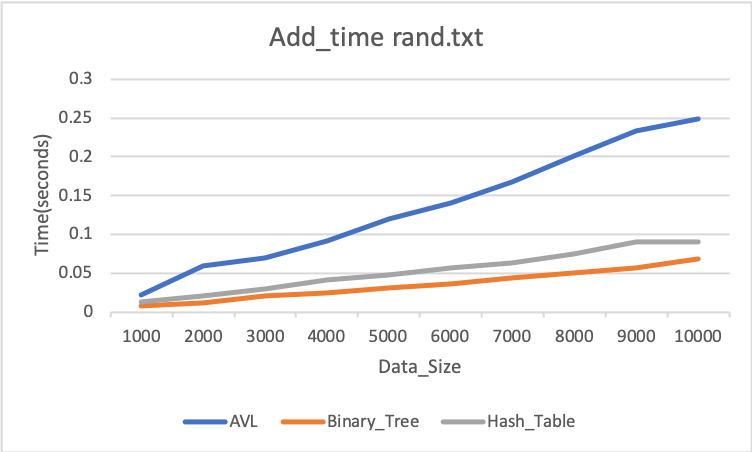
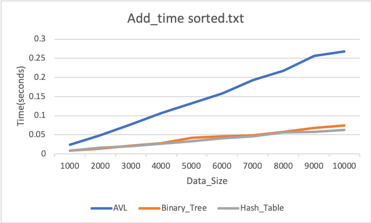
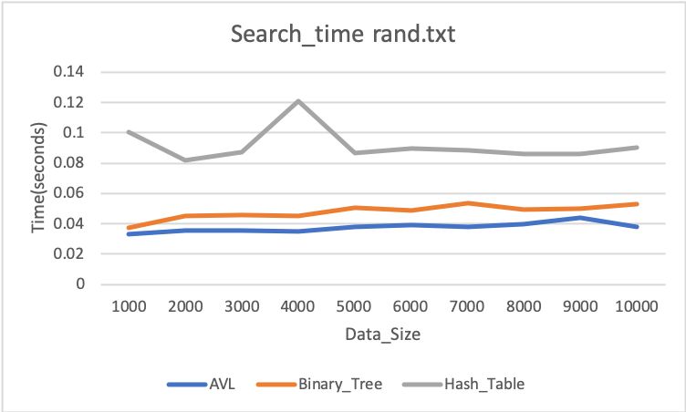
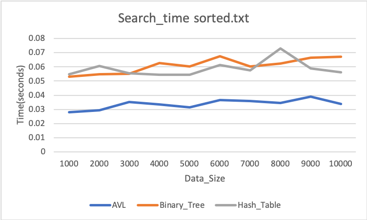
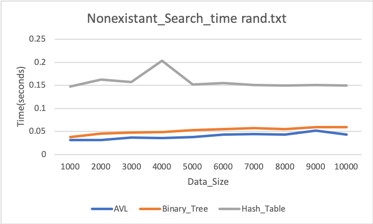
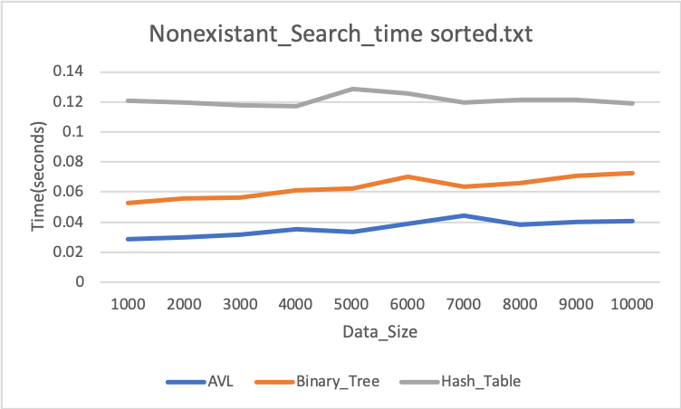

# trees-sahu0957
A collection of scripts which compare the relative efficiencies of different data structures in adding and search for key/value pairs

## Installation
Run the following to install all the necessary dependencies for this repo.
```sh
wget https://repo.anaconda.com/miniconda/Miniconda3-latest-Linux-x86_64.sh
bash Miniconda3-latest-Linux-x86_64.sh -b
~/miniconda3/etc/profile.d/conda.sh
conda update --yes conda
conda config --add channels r
conda create --yes -n test
conda activate test
conda install -y pycodestyle
conda install --yes python=3.6
conda install conda install -c conda-forge time
git submodule update --init
```
The following python modules will also be needed
```python
import time
import argparse
import sys
import os
import importlib
from os import path
import importlib.util
```

## Running the program
Specify a data structure (hash, binary, or avl) and an input file. Specify a data size, which corresponds to how many keys to pull from the data set (between 30 and 10000).
```python
STRUCTURE='hash'
FILE='rand.txt'
SIZE=10000
python insert_key_value_pairs.py \
        --data_structure $STRUCTURE \
        --data_size $SIZE \
        --dataset $FILE
```
This will print out benchmarking information, which can be used to compare the relative efficiencies of each data struture

## Benchmarking Results
Below are graphs of various benchmarking tests








Overall, the AVL tree is slower when adding new values, but much faster in searching for these values. The hash table generally performs slowest overall, but has a compartatively fast add speed when the data size is small. The binary tree seemed to be a middle ground between the hash table's speed and the AVL tree's speed.

## Release History
*1.0\
	*ADDED:Submodules for AVL Trees and Hash Tables\
	*ADDED:Functional and unit tests for binary_tree.py and insert_key_value_pairs.py\
	*ADDED:Continuous integration testing with Travis\
	*ADDED:insert_key_value_pairs.py script, which provides benchmarking information for various data structures\
	*ADDED:sorted.txt and rand.txt data sets, which are sets of strings used for testing the speed of each data structure\
	*CHANGE:binary_tree.py script was adjusted to add keys to a nonbalancing tree\
	*CHANGE:Adjusted all scripts to be compliant with PEP8 standards
## To Contribute
1. Fork it (< https://github.com/cu-swe4s-fall-2019/trees-sahu0957.git>)
2. Create your feature branch (`git checkout -b feature_branch`)
3. Commit your changes (`git commit -m 'add your notes'`)
4. Push to the branch (`git push origin feature_branch`)
5. Create a new Pull request
